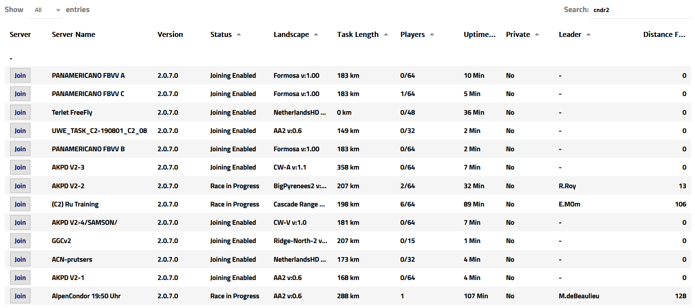
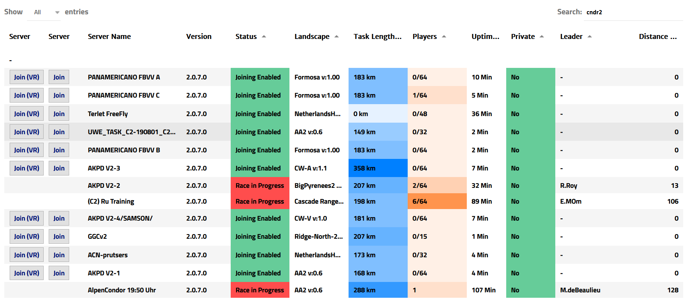

# Condor2 Extension

## Introduction

Condor2 Extension is a browser extension which enhances the [Condor Server List](http://www.condorsoaring.com/serverlist/?wdt_search=cndr2). It greatly simplifies the process of finding a server by colour-coding columns, and adds buttons which allow VR users to seamlessly launch multiplayer sessions using Revive when the [Condor2 Revive Helper](https://github.com/TheGreatCabbage/condor2-revive-helper) is installed.

## Installing

For Firefox, go to [Condor2 Extension](https://addons.mozilla.org/en-GB/firefox/addon/condor2extension/) on the official Firefox addons website and click "Add to Firefox".

For Google Chrome, follow the instructions on the [Releases](https://github.com/TheGreatCabbage/condor2-extension/releases) page.

## Comparison

#### Condor Server List


#### Condor Server List with the extension installed


## Building From Source

This extension is written in Kotlin/JS. To build it, execute the Gradle task `runDceKotlin`. You can then use `web-ext run` to test the plugin.

After building, you can package the extension as an `.xpi` file for Firefox and `.zip` file for Chrome by running `python package.py` (currently requires 7-Zip and Windows).

#### Windows (Powershell)

In the project's root directory:
```
.\gradlew runDceKotlin
```

#### Linux (Bash)

In the project's root directory:
```
chmod +x ./gradlew
./gradlew runDceKotlin
```